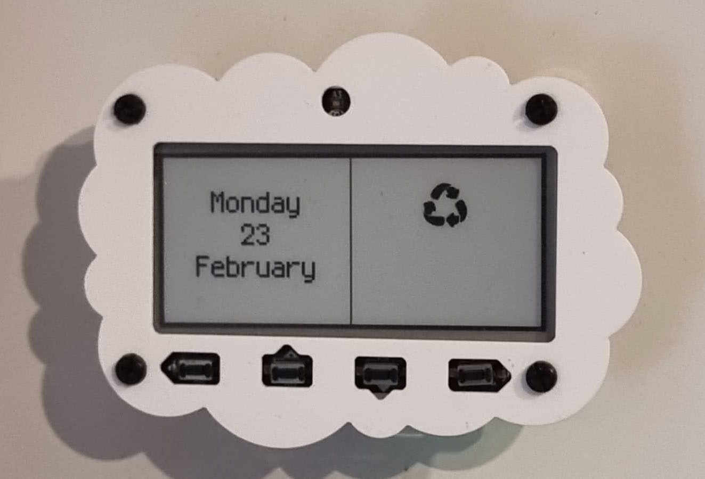
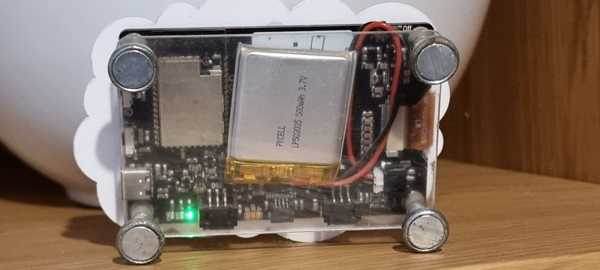

# Bins Out

Bins Out is an Adafruit MagTag fridge e-ink display that shows the next waste collection date and type (refuse, recycling, glass, garden) and then deep-sleeps to conserve battery.

- Device: Adafruit MagTag 2.9" grayscale
- Typical battery life: ~8 to 10 weeks
- Runtime behavior: wake -> sync time -> choose next collection -> render -> deep sleep

<p align="center">
  
  
</p>

## Table of Contents

- [Why This Project](#why-this-project)
- [Project Status](#project-status)
- [Hardware and Firmware Compatibility](#hardware-and-firmware-compatibility)
- [Bill of Materials (BOM)](#bill-of-materials-bom)
- [Quick Setup](#quick-setup)
- [1) Install CircuitPython on MagTag](#1-install-circuitpython-on-magtag)
- [2) Install Libraries](#2-install-libraries)
- [3) Configure Wi-Fi and Secrets (Safe Workflow)](#3-configure-wi-fi-and-secrets-safe-workflow)
- [4) Deploy Runtime Files to `CIRCUITPY`](#4-deploy-runtime-files-to-circuitpy)
- [5) Verify the Installation](#5-verify-the-installation)
- [Data Format and Maintenance](#data-format-and-maintenance)
- [Run Tests Locally](#run-tests-locally)
- [Test Coverage](#test-coverage)
- [Troubleshooting](#troubleshooting)
- [Known Limitations](#known-limitations)
- [Roadmap](#roadmap)
- [Contact and Demo](#contact-and-demo)
- [Media](#media)
- [License](#license)

## Why This Project

This is a practical hardware/software showcase that demonstrates:

- Low-power embedded behavior with deep sleep scheduling.
- Real-world reliability features (`OFFLINE`, `STALE`, fallback sleep windows).
- Defensive handling around network and data failures.
- Data-driven rendering from a structured schedule file.
- Maintainable host-side unit tests for core date/time logic.
- I constantly forget which bin I need to put out

## Project Status

- Status: Active personal hardware/software showcase project.
- Deployment target: CircuitPython on MagTag.
- Last verified test run: 2026-02-26 with `python3 -m unittest discover -s tests -p 'test_*.py'` (20 tests passing across 7 files).

## Hardware and Firmware Compatibility

There are multiple MagTag revisions. A quick visual cue from Adafruit docs:

- Older boards: white soldermask
- 2025 Edition: black soldermask

> WARNING: The Adafruit MagTag 2025 Edition does not work with CircuitPython 9.2.x or earlier. Use CircuitPython 10.x.x or later.

| MagTag revision | CircuitPython guidance | Notes |
| --- | --- | --- |
| Pre-2025 MagTag | 9.2.9 is supported; 10.x can be used with TinyUF2 update path | Useful if you want the stable 9.2.9 `.bin` link below |
| MagTag 2025 Edition | 10.x.x or later required | Do not install 9.2.x |

Official references:

- MagTag guide: https://learn.adafruit.com/adafruit-magtag
- CircuitPython install page: https://learn.adafruit.com/adafruit-magtag/circuitpython
- CircuitPython board downloads: https://circuitpython.org/board/adafruit_magtag_2.9_grayscale/
- TinyUF2 update for CircuitPython 10 on 4MB boards: https://learn.adafruit.com/adafruit-magtag/update-tinyuf2-bootloader-for-circuitpython-10-4mb-boards-only

Direct legacy firmware link (easy to miss on the downloads site):

- CircuitPython `9.2.9` `.bin` for pre-2025 MagTag: https://downloads.circuitpython.org/bin/adafruit_magtag_2.9_grayscale/en_GB/adafruit-circuitpython-adafruit_magtag_2.9_grayscale-en_GB-9.2.9.bin

## Bill of Materials (BOM)

| Item | Required | Notes |
| --- | --- | --- |
| Adafruit MagTag 2.9" grayscale | Yes | Main board and display |
| USB data cable | Yes | Must be a data cable, not charge-only |
| USB power source | Yes | For flashing/configuration and optional wall power |
| Mounting material (magnetic M3 feet, magnet strip, adhesive, stand) | Yes | Depends on your install location |
| LiPo battery (optional) | No | For fully wireless operation |

Cost guide (USD): retail pricing varies by region and supplier; check current pricing on product pages before purchasing.

## Quick Setup

1. Install CircuitPython on your MagTag (based on your board revision).
2. Install libraries to `CIRCUITPY/lib` (primary path below).
3. Edit the cleaned `secrets.py` and add your Wi-Fi credentials.
4. Deploy runtime files to `CIRCUITPY`.
5. Reset the board and verify expected behavior.

## 1) Install CircuitPython on MagTag

Follow: https://learn.adafruit.com/adafruit-magtag/circuitpython

Common flow:

1. Put board into bootloader mode (`MAGTAGBOOT`) if available.
2. Copy the appropriate firmware (`.uf2` or `.bin`) for your board/revision.
3. Reconnect and confirm `CIRCUITPY` appears.

If bootloader mode is not available on very early boards, use the `.bin` flashing path (esptool/WebSerial) from Adafruit docs.

## 2) Install Libraries

Primary path for this repo:

- Copy this repository's `lib/` folder to `CIRCUITPY/lib`.

Fallback path (recommended if you hit `.mpy` version errors):

- Install from the official CircuitPython bundle that matches your exact CircuitPython major/minor version.

Library sources:

- Bundle downloads: https://circuitpython.org/libraries
- General library guide: https://learn.adafruit.com/welcome-to-circuitpython/circuitpython-libraries
- MagTag dependency guide: https://learn.adafruit.com/adafruit-magtag/magtag-specific-circuitpython-libraries

Minimum modules used by this codebase:

- `adafruit_magtag/`
- `adafruit_portalbase/`
- `adafruit_display_text/`
- `adafruit_bitmap_font/`
- `adafruit_displayio_layout/`
- `adafruit_requests.py` (or `.mpy`)
- `adafruit_datetime.py`
- `neopixel.mpy`
- `simpleio.mpy`

## 3) Configure Wi-Fi and Secrets (Safe Workflow)

Edit `secrets.py`:

```python
secrets = {
    "ssid": "YOUR_WIFI_NAME",
    "password": "YOUR_WIFI_PASSWORD",
    "timezone": "Europe/London",
}
```

Notes:

- This repository includes a cleaned `secrets.py` template (`ssid` and `password` are blank).
- Avoid committing real credentials after adding your local values.
- Current code uses a hardcoded timezone in `world_date.py` for the API URL.
- `secrets["timezone"]` is defined but is not yet wired into `TIME_URL`.

## 4) Deploy Runtime Files to `CIRCUITPY`

Deploy by copy command (macOS):

```bash
BOARD=/Volumes/CIRCUITPY

cp code.py setup.py display.py utils.py time_calc.py world_date.py data.json secrets.py "$BOARD"/
cp -R bmps "$BOARD"/
cp -R lib "$BOARD"/
```

If your board mount path differs, update `BOARD`.

Do not copy:

- `assets/` (media only, too large for board storage)
- `tests/` (host-side unit tests only)

Optional schedule rollover:

- `data-2026.json` can be promoted to `data.json` when needed.

## 5) Verify the Installation

After reset, expected behavior:

1. Device wakes and attempts Wi-Fi connection.
2. Device fetches current time from `timeapi.io`.
3. Device displays next collection date and the correct icon background.
4. Device enters deep sleep.

Expected fallback states:

- `OFFLINE`: no current date available.
- `STALE`: using cached date from file/sleep memory.
- `NO MORE DATES`: no future entries in `data.json`; sleeps and retries later.

## Data Format and Maintenance

`data.json` structure:

```json
{
  "dates": [
    {
      "date": "2026-03-02T23:59:59.000000+00:00",
      "garden": true,
      "refuse": true,
      "glass": false,
      "recycling": false,
      "bhChange": false
    }
  ]
}
```

Rules:

- `date` must be ISO 8601 with timezone offset.
- Keep `dates` in ascending chronological order.
- Keep at least one future date; otherwise display will show `NO MORE DATES`.
- Update the schedule file annually.

## Run Tests Locally

```bash
python3 -m unittest discover -s tests -p 'test_*.py'
```

## Test Coverage

Current suite (`20` tests) is split across these files:

- `tests/test_time_calc.py`: ISO date math (`minus_hours_to_date`, `difference_in_seconds`) including timezone offset handling.
- `tests/test_utils.py`: selects the correct next collection date and placeholder behavior when no future dates exist.
- `tests/test_utils_cache.py`: cached-date file read/write path and read-only filesystem fallback to sleep memory.
- `tests/test_world_date.py`: `timeapi.io` parsing success path and error handling on network/bad payload.
- `tests/test_display.py`: date label rendering and icon background selection for each collection type combination.
- `tests/test_setup.py`: Wi-Fi connection setup from `secrets` and request session/socket pool creation.
- `tests/test_code_runtime.py`: core `code.py` runtime branches (`OFFLINE`, `STALE`, `NO MORE DATES`) using hardware/module stubs.

## Troubleshooting

- `CIRCUITPY` does not appear:
  - Use a known good USB data cable.
  - Replug and press Reset.
- `MAGTAGBOOT` does not appear:
  - Double-tap Reset.
  - Use the early-board `.bin` flashing path if needed.
- `.mpy` import/version error:
  - Reinstall libraries from a bundle matching the installed CircuitPython version.
- Wrong date/timezone:
  - Check `TIME_URL` in `world_date.py`.
  - Check network and `secrets.py`.
- `NO MORE DATES` on display:
  - Add future entries to `data.json`.

## Known Limitations

- Timezone is currently hardcoded in `world_date.py` (`TIME_URL`).
- Bin schedule updates are manual (`data.json` maintenance).
- No over-the-air data update pipeline yet.

## Roadmap

- Use `secrets["timezone"]` dynamically instead of hardcoded timezone in `world_date.py`.
- Automate schedule generation/update.
- Add CI for host tests.
- Add optional diagnostics screen for Wi-Fi/time sync failures.

## Contact and Demo

- Demo video: `assets/video.mp4`
- Demo photos: `assets/front.jpeg`, `assets/back.jpeg`
- Portfolio: `https://github.com/adamsinnott/`

## License

This project is licensed under the MIT License. See `LICENSE`.
